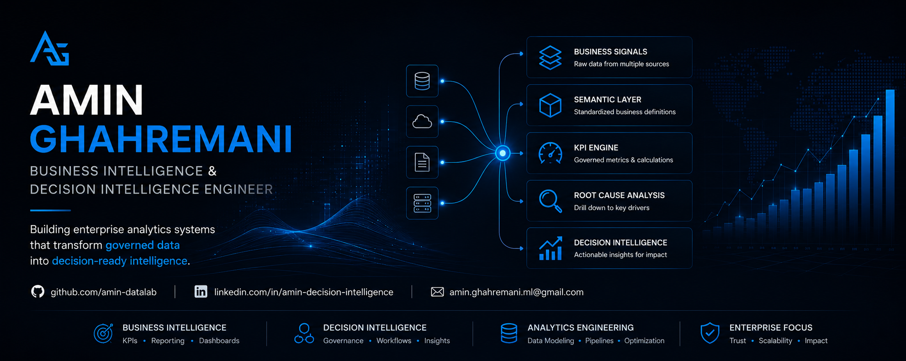
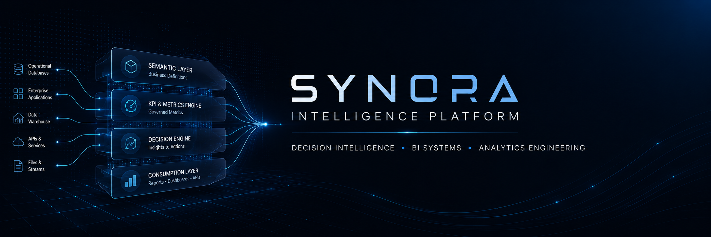

  

  

 

# Amin Ghahremani

**Business Intelligence & Decision Intelligence Engineer**

*Architecting enterprise analytics systems that transform operational data into governed, decision-ready intelligence.*

 

## Core Focus

* Enterprise Business Intelligence systems
* Decision Intelligence architectures
* KPI governance & semantic data modeling
* Executive analytics & reporting platforms

 

## Featured Project

  

### Synora Intelligence Platform

Enterprise Decision Intelligence system designed to convert operational data into governed, explainable business decisions.

**Core Capabilities**

- Semantic KPI Layer
- Decision Engine
- Root Cause Analysis (RCA)
- Star Schema Analytics Architecture
- Power BI Enterprise Consumption Layer

 

## Expertise

| Domain | Focus |
|--------|-------|
| Business Intelligence | KPI frameworks, executive dashboards, enterprise reporting |
| Decision Intelligence | Semantic modeling, decision workflows, insight-to-action systems |
| Data Analytics | Root cause analysis, performance analytics, business insights |
| Data Modeling | Dimensional modeling, star schema design, metric governance |

 

## Technology Stack

**Core Languages**
SQL · Python · DAX

**BI & Analytics**
Power BI · Tableau

**Data Systems**
PostgreSQL · SQL Server

**Engineering Workflow**
Git · Data modeling · Analytics pipelines

 

## Current Portfolio

- Synora Intelligence Platform → Active (Public Release)
- Executive KPI Command Center → In Development
- FinTech Lending Analytics → Planned

 

## Connect

GitHub  
https://github.com/amin-datalab

LinkedIn  
https://www.linkedin.com/in/amin-decision-intelligence/

Email  
mailto:amin.ghahremani.ml@gmail.com

## Philosophy

I build Business Intelligence systems that move beyond dashboards.

Transforming operational data into governed metrics and structured decision intelligence.

My focus is operationalizing intelligence through scalable analytics systems.
